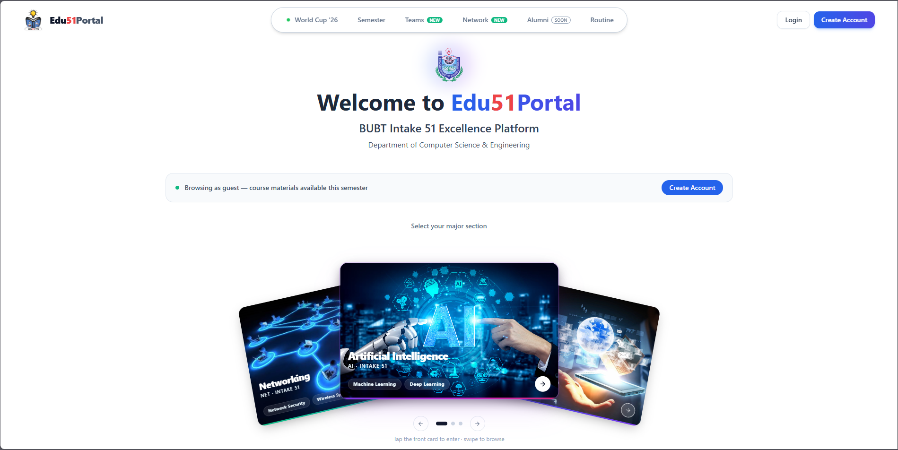
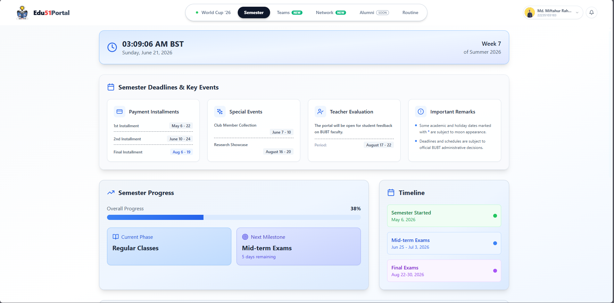

# Edu51Portal

Academic portal for **BUBT Intake 51 – Section 5** students. Built as a fast, fullstack SPA with realtime features, social profiles, team collaboration, and a live FIFA World Cup 2026 tracking event.

**Live:** [edu51portal.live](https://edu51portal.live) · [edu51five.vercel.app](https://edu51five.vercel.app)

---

## Tech Stack

| Layer | Choice |
|-------|--------|
| Frontend | React 18 + TypeScript + Vite |
| Styling | Tailwind CSS 3.4 + daisyUI 5.5 |
| Backend / DB | Supabase (PostgreSQL + RLS + Edge Functions) |
| Auth | Supabase Auth (email/password + magic link) |
| Storage | Supabase Storage (avatars, team assets) |
| Hosting | Vercel |
| Push Notifications | Web Push API + VAPID + service worker |

---

## Features

### Core Academic
- **Student Dashboard** — intake and section view, course browser, file delivery (upload or Drive links)
- **PDF Viewer** — modal preview with fullscreen and mobile support
- **Semester Tracker** — real-time progress bar, milestone timeline, countdown to next exam
- **Custom Routine** — personal schedule builder with export
- **Admin Dashboard** — course manager, file upload, Drive integration, user management

### Social & Collaboration
- **LinkedIn-style Profiles** — avatar, cover photo, headline, education, experience, skills
- **Connections** — send / accept connection requests, discovery feed
- **Team Building** — create and discover teams (2–7 members), roles, invitations, join requests, announcements
- **Alumni Hub** — BUBT alumni directory (admin-verified)

### World Cup 2026 (Live Event)
- **Team Picker** — choose one of 48 WC2026 teams to support
- **Live Leaderboard** — earn points (win = 3, draw = 1, +1 per goal) ranked against classmates
- **Match Center** — all 104 matches with live scores, auto-refresh every 60 s during live play
- **Intro Modal** — shown once on first login to guide new users into the event

### Platform
- **Push Notifications** — service worker + VAPID, opt-in per user
- **Dark / Light Mode** — system-aware toggle persisted per user
- **Responsive** — mobile-first, tested on Chrome / Safari / Firefox

---

## Project Structure

See [docs/PROJECT-STRUCTURE.md](docs/PROJECT-STRUCTURE.md) for a full feature → file → line-number map.

---

## Local Setup

```bash
git clone https://github.com/Swapnil-360/Edu51Five
cd Edu51Five
npm install
cp .env.example .env          # fill in Supabase keys
npm run dev
```

Environment variables required (see `.env.example`):

```
VITE_SUPABASE_URL=
VITE_SUPABASE_ANON_KEY=
VITE_VAPID_PUBLIC_KEY=
```

---

## Database Migrations

All schema changes live in `supabase/migrations/`. Apply them in order via the Supabase CLI or MCP.

```bash
supabase db push   # applies pending migrations to remote
```

---

## Screenshots

| Dashboard | Semester Tracker |
|-----------|------------------|
|  |  |
