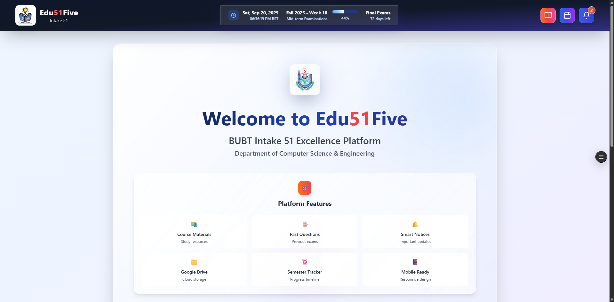
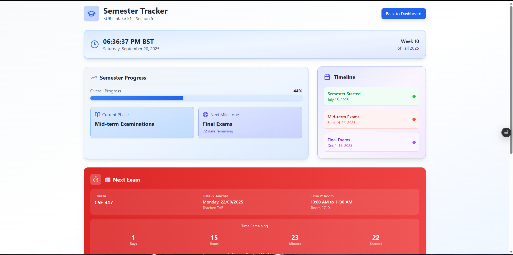

# 🎓 Edu51Five

**Edu51Five** is a modern academic portal built for  
**BUBT Intake-51 – Section-5** students.  
It centralizes courses, files, semester tracking, and admin tools in one responsive web app.

---

## ✨ Key Features
- **Student Dashboard** – View courses, intakes, and section details.
- **Admin Dashboard** – Manage courses, upload and manage study materials.
- **Semester Tracker** – Real-time progress bar, timeline, and countdown to the next exam.
- **Smart File Delivery**  
  - Upload directly via the admin panel (immediate availability).  
  - Or embed external drive links (for large storage & quick preview).
- **PDF Viewer** – Modal preview with fullscreen & mobile support.
- **Search & Filter** – Quickly find any course or file.
- **Responsive UI** – Smooth on desktop, tablet, and mobile.
- **Animated UI Elements** – Progress bars, milestone indicators, custom scrollbars.

---

## 🖼️ Screenshots

| Dashboard | Semester Tracker |
|-----------|------------------|
|  |  |

---

## 🛠️ Tech Stack
- **Framework**: Next.js 13 + React
- **Language**: TypeScript
- **Database & Auth**: Supabase
- **UI**: Tailwind CSS
- **Hosting**: Vercel

---

## 🚀 Getting Started
- **Link**: https://edu51five.vercel.app/
